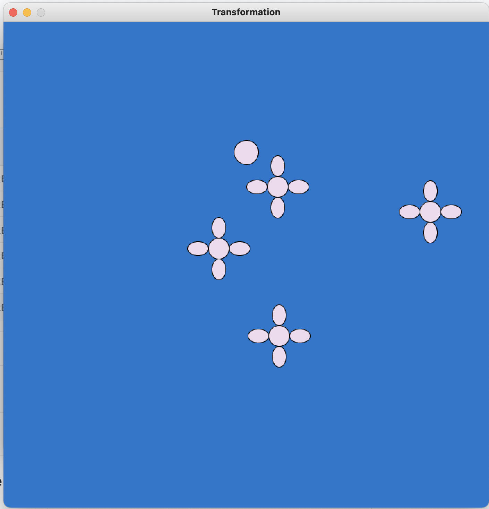

# Here is a project on transformation and classes!
## Interactive art !
### The part where I use pelin noise that inspiration comes from the pelin noise tutorial video by prof. Dan Shiffman.

## Flowers spinning and the circle be noising
And this is the link to the video of how it works: https://youtu.be/-LEi8injuJk

