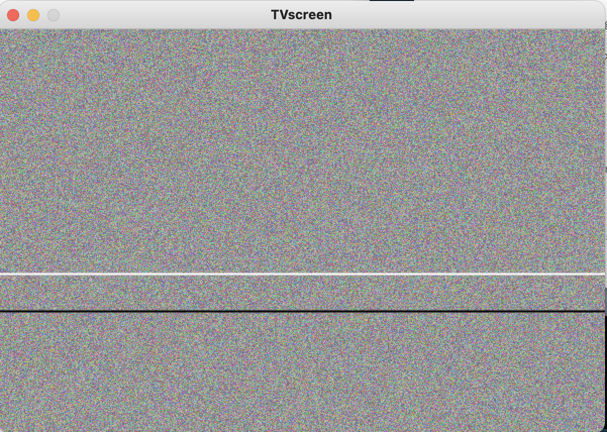

# TV Screen Effect using Pixels and Images

### Here is the link to the video: https://youtu.be/8-Av0-pAins

This is a relatively simple one.  
The Logic of this program is to have it mimic the situation when the TV is broken.  
The pixels changes color randomly for the background to look like the fickering pixels.  
And then the lines randomly popping in the frame is made using the ````noise()```` function.

### Stage 1. 


### Stage 2  

