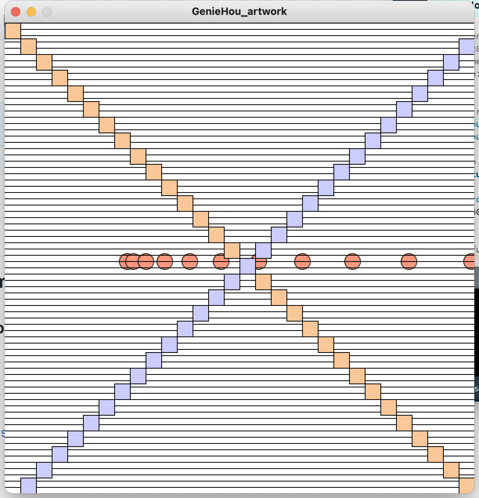

## Here is the assignment for the 3rd class
### Processing Art Creation

For this assignment, I find it a super fun and creative piece.  
The obstacles I have faced are getting the circles to show up randomly the way I would like it to be.

If I put the random function inside of the draw function, then the circles would just always shows up in random and unorganized order.

So when I put the random x and y assignment out side of the draw function, that is when I find the pattern I want it to be.

And through this assignment I realized if the two patterns are in the same loop, the pattern function that is called first in this instance the lines are always on top.

In my program, the circles and the lines are from the same loop.

